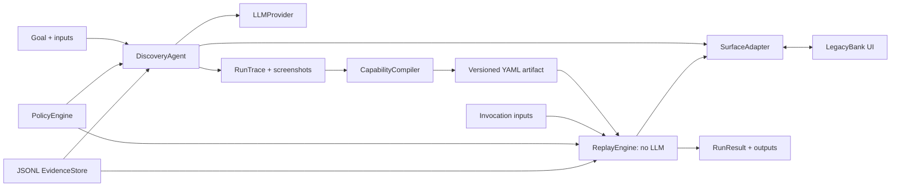

# Computer-Use Capability Runtime

> The model discovers; the artifact becomes the capability; deterministic replay is production execution.

The current vertical slice discovers the fake savings-balance workflow in a live browser with an OpenAI-compatible model, compiles a draft YAML capability for review, then executes that capability without any model dependency. It is a reusable runtime design, not a real banking integration.



## Setup

Use Node 20+ and install dependencies. Playwright can use its own Chromium (`npx playwright install chromium`) or an existing Google Chrome (`PLAYWRIGHT_CHANNEL=chrome`). The latter is what was used for the local verified runs.

```bash
npm install
npx playwright install chromium
cp .env.example .env
```

Edit `.env` locally; it is Git-ignored. For the demonstrated local Qwen OpenAI-compatible endpoint:

```dotenv
QWEN_BASE_URL=http://127.0.0.1:8080/v1
QWEN_MODEL=/absolute/path/to/your/qwen-model-id
PLAYWRIGHT_CHANNEL=chrome
```

The provider sends the compatibility key `local` automatically for a Qwen endpoint. For OpenAI or another compatible cloud endpoint, set `OPENAI_BASE_URL`, `OPENAI_API_KEY`, and `OPENAI_MODEL` instead. If a compatible server does not support JSON response mode, set `OPENAI_JSON_MODE=false`; every response is still Zod-validated. The provider uses the documented [Chat Completions endpoint](https://developers.openai.com/api/reference/cli/resources/chat/subresources/completions).

## Run the demo

In terminal one:

```bash
npm run demo
```

Open <http://localhost:4000>. In terminal two:

```bash
npm run discover -- \
  --goal "Look up member 12345 and return the current savings balance and currency" \
  --target http://localhost:4000 \
  --input member_id=12345
```

Discovery prints a run ID and a generated `capabilities/generated/get-savings-balance-<run-id>.yaml` path. Use that exact path for both replays:

```bash
npm run replay -- \
  --capability capabilities/generated/get-savings-balance-<run-id>.yaml \
  --input member_id=12345

npm run replay -- \
  --capability capabilities/generated/get-savings-balance-<run-id>.yaml \
  --input member_id=40400
```

The first returns `{balance: 12340.22, currency: "USD"}`. The second returns `BUSINESS_OUTCOME / MEMBER_NOT_FOUND`, not a thrown exception. `npm run typecheck` and `npm test` verify the schema and runtime units.

## Deterministic demo member IDs

| Member ID | Result |
|---|---|
| `12345` | Normal member with a savings balance |
| `40400` | Member not found |
| `40300` | Permission denied |
| `50000` | Simulated application error |
| `70000` | Delayed response |
| `88888` | Unexpected modal requiring human attention |

All names and account data are fictional.

## Discovery, artifact, and replay

`PlaywrightSurfaceAdapter` observes visible text, controls, dialogs, and iframe summaries; the model chooses one validated action at a time. Policy authorizes before execution. Each step creates JSONL events and PNG observations. The `RunTrace` retains raw discovery evidence and is not the reusable artifact.

`CapabilityCompiler` accepts a successful trace plus explicit demo hints for input/output names, output table cells, and the known no-member outcome. It keeps successful actions, substitutes `{from_input: member_id}`, removes the observed invocation value from reusable descriptions, and writes a draft schema-versioned artifact. The [schema example](capabilities/get-savings-balance.example.yaml) shows target IDs, ordered semantic locator strategies, bounded recovery, output checkpoints, and a business-outcome checkpoint. Generated artifacts live under `capabilities/generated/` for human review.

`ReplayEngine` imports no LLM provider and takes only artifact, inputs, surface, policy, and evidence. It resolves inputs, checks policy, executes locators in declared order, checks known outcomes before continuing, verifies output checkpoints, and returns a typed result. The savings value is located by iframe title plus Savings row and Current Balance column—not by `data-field` or test IDs.

## Results, evidence, and safety

Run results distinguish `SUCCESS`, `BUSINESS_OUTCOME`, `HARD_FAILURE`, and `HUMAN_REQUIRED`; the `RECOVERABLE` category is reserved for explicit bounded recovery. A failed step cannot silently continue. Replay retries only when its artifact explicitly permits a bounded attempt count. JSONL events and PNG screenshots live in `evidence/{discovery,replay}/run-<id>/`; logs redact secret-like keys and configured sensitive inputs.

Policy code enforces allowed domain, route, action type, and risk behavior in both planes. The demo uses fictional data and the sub-account flow stops at review. No credentials, browser storage state, cookies, or model keys are committed.

Current cuts: `88888` is detected and returns `HUMAN_REQUIRED/UNEXPECTED_DIALOG`, but there is no operator UI or same-session pause/resume yet. No cross-tenant inheritance engine, visual AI locator recovery, or model-assisted replay recovery. The current compiler uses explicit demo output hints rather than pretending fully autonomous inference.
